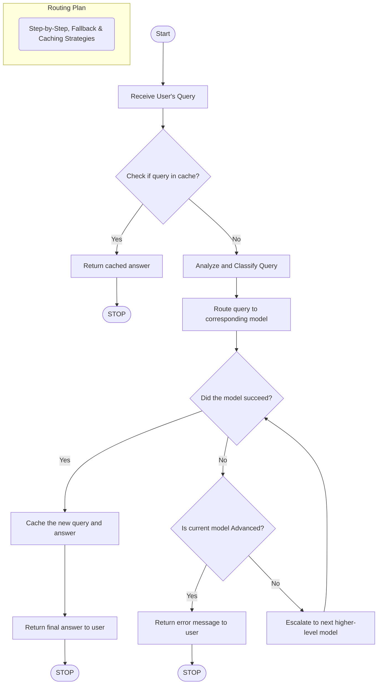

# 🧠 Dynamic LLM Query Router


<br>

This project is an **interactive web application** that intelligently classifies user queries and routes them to the most appropriate Large Language Model (LLM). Built with Streamlit and LangChain, it provides an efficient, scalable, and user-friendly interface to a powerful multi-model backend that optimizes for both cost and performance.

---
## Project Structure


## 🚀 Core Features

-   **✨ Interactive Web UI**: A beautiful and responsive interface built with Streamlit, featuring a custom dark mode theme, one-click example prompts, and real-time feedback.
-   **🧠 Dynamic Routing**: Intelligently classifies queries into `Simple`, `Medium`, or `Advanced` to determine their complexity before execution.
-   **⚙️ Multi-Model Architecture**: Uses different Hugging Face LLMs for different tasks, optimizing for speed, cost, and analytical power.
-   **🛡️ Robust Fallback Mechanism**: If a chosen model fails, the system automatically retries the query with the next, more powerful model to ensure the user always gets a response.
-   **⚡ Response Caching**: Caches answers to previously seen queries to provide instant results and minimize redundant API calls.
-   **🔍 Transparent Logging**: The UI includes an expandable section to view the router's decision-making process and any errors encountered during execution.

---

## 🛠️ Setup and Installation

Follow these steps to get the project running on your local machine.

### 1. Clone the Repository
```bash
git clone [https://github.com/yousseifmustafa/Dynamic-Routing-for-LLM-Models.git](https://github.com/yousseifmustafa/Dynamic-Routing-for-LLM-Models.git)
cd Dynamic-Routing-for-LLM-Models
```

### 2. Create and Activate a Virtual Environment
```bash
# For Windows
python -m venv venv
.\venv\Scripts\activate

# For macOS/Linux
python3 -m venv venv
source venv/bin/activate
```
---
### 3. Install Dependencies
Create a `requirements.txt` file with the content below, then install all packages using pip.
```txt
# requirements.txt
streamlit
python-dotenv
langchain-huggingface
langchain_core
```
Now, run the installation command:
```bash
pip install -r requirements.txt
```
---
### 4. Set Up Environment Variables
Create a file named `.env` in the root directory and add your Hugging Face API token.
```
HF_API_KEY="your_hugging_face_api_key_here"
```


---

## 🚀 How to Run the App

With your virtual environment activated, run the Streamlit application from your terminal.

```bash
streamlit run app.py
```
Your web browser will automatically open with the application running.

---

## 🤖 Models Used

This project is configured to use the following models from Hugging Face:

| Role          | Model Name                          | Purpose                               |
| :------------ | :---------------------------------- | :------------------------------------ |
| **Router** | `meta-llama/Llama-3.2-3B-Instruct` | Fast and efficient query classification. |
| **Simple Tier** | `meta-llama/Llama-3.2-3B-Instruct` | Handling basic, straightforward questions. |
| **Medium Tier** | `meta-llama/Meta-Llama-3-8B-Instruct` | General-purpose tasks and explanations. |
| **Advanced Tier** | `mistralai/Mixtral-8x7B-Instruct-v0.1` | Complex analysis, coding, and reasoning. |


---

## 📂 Project Structure
```
/
├── app.py            # The main Streamlit application UI
├── router_logic.py   # Core classification and routing logic
├── requirements.txt  # Project dependencies
└── .env              # Environment variables (API keys)
```

---

## 📜 License

This project is licensed under the MIT License.

Created with ❤️ by **[Youssef Mustafa](https://github.com/yousseifmustafa)** © 2025
